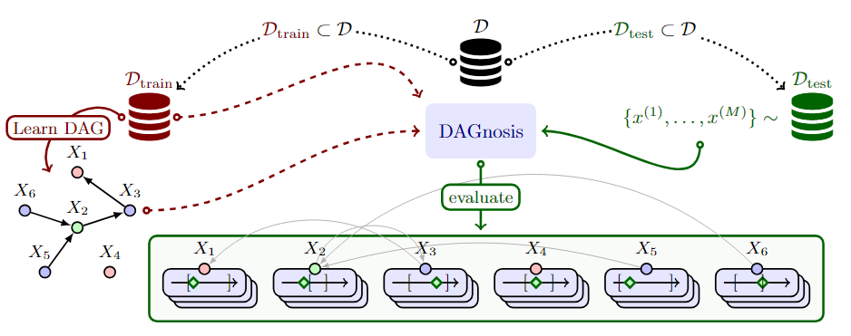

# DAGnosis: Localized Identification of Data Inconsistencies using Structures



<p align="center">
    <a href="https://github.com/nicolashuynh/DAGnosis/actions/workflows/python-app.yml/badge.svg"></a>
    <a href="https://github.com/nicolashuynh/DAGnosis/blob/main/LICENSE"></a>
</p>

This repository accompanies the AISTATS'24 paper: [DAGnosis: Localized Identification of Data Inconsistencies using Structures](https://arxiv.org/abs/2402.17599).


# 1. Install
We suggest creating a new environment with conda (with `Python 3.10` or newer) after cloning the repo, e.g. with:
```shell
conda create --name dagnosis python=3.10
conda activate dagnosis
```
You can then install the package from source with the following command:
```shell
pip install .
```

# 2. Use
### Example usage

```python
from dagnosis.conformal.significance_correction import BonferroniCorrection
from dagnosis.conformal.conformal_evaluator import ConformalEvaluator
from dagnosis.representation.representation_mapper import DAGRepresentationMapper, PCARepresentationMapper
from dagnosis.dag_learner.extractor import GroundTruthDAG

significance = 0.1 # Control the FWER

X_train, X_test = ... # Data (numpy arrays)

list_features = ... # List of features for which we want to use the conformal estimators

conf_predictor_dict = ... # Define the DictConfig object for the conformal predictors 
conformal_evaluator =  ConformalEvaluator(conf_predictor_cfg=conf_predictor_cfg)

# Define a structure-based representation mapper
dag = ... #Define the DAG
dag_representation = DAGRepresentationMapper()
dag_representation.set_dag(dag)
dag_representation.fit(X_train)

# Significance level adjusment to control the FWER
significance_corrector = BonferroniCorrection()
alphas_adjusted = significance_corrector.compute_correction(significance=significance, list_of_features=list_features)

#Train 
conformal_evaluator.train(X_train = X_train, representation_mapper=dag_representation, list_features=list_features, alphas_adjusted=alphas_adjusted)

# Test 
conf_dict = conformal_evaluator.predict(X_test list_features=list_features)
```


### Synthetic experiments
The folder `experiments/synthetic` contains the files for the synthetic experiments.
The bash scripts located in the folder `scripts` contain the bash scripts `run_linear.sh` and `run_mlp.sh` which run the full pipeline: 1) generate the data, 2) train the conformal estimators, and 3) test the conformal estimators (for linear and MLP SEMs respectively).

Once the pipeline has finished running, you can compute the inconsistency detection metrics (F1, Precision, Recall), by going to the folder `experiments/synthetic` and running:
```shell
python parse_metrics.py PATH_SAVE_METRIC=path_metrics
```
where `path_metrics` denotes the folder where the metrics are saved.

Note that you can modify the configurations of the experiment by either:
- a) modifying the config files in the `conf` folder
- b) using the [hydra override syntax](https://hydra.cc/docs/advanced/override_grammar/basic/) on the command line


#### UCI Adult Income experiments
To run the experiments on the UCI Adult Income dataset, go to the folder `experiments/adult`.
In order to train and test the conformal estimators, run
```shell
python train_test_adult.py
```
The artifacts will be saved in the folder `artifacts_adult`.
Then, the results can be obtained by executing:
```shell
python proportion_flagging.py
```
which will print the list of downstream accuracies and proportions of samples flagged.


# 3. Citing
If you use this software, please cite the original paper:
```shell
@inproceedings{huynh2024dagnosis,
  title={DAGnosis: Localized identification of data inconsistencies using structures},
  author={Huynh, Nicolas and Berrevoets, Jeroen and Seedat, Nabeel and Crabb{\'e}, Jonathan and Qian, Zhaozhi and van der Schaar, Mihaela},
  booktitle={International Conference on Artificial Intelligence and Statistics},
  pages={1864--1872},
  year={2024},
  organization={PMLR}
}
```
